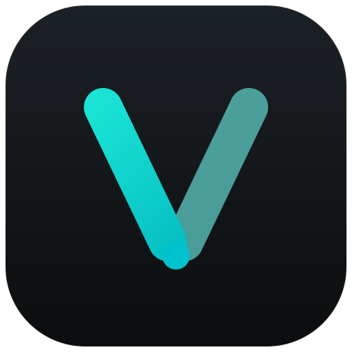

<div align="center">



# VERBALIS

**Local-first CAT tool for translators who can't afford to leak a sentence.**

[Launch the app](https://verbalis.britx.me/) ·
[GitHub](https://github.com/pedrobritx/verbalis) ·
[License](LICENSE.md) ·
[Buy me a coffee](https://buymeacoffee.com/pedrobritx)

</div>

---

## Why Verbalis exists

Verbalis started with a stubborn problem: I needed to translate sensitive,
security-critical material and there was no tool I could fully trust. The
mainstream options wanted my documents on their servers. The privacy-respecting
ones couldn't speak the formats real translation work runs on — XLIFF, TMX,
TBX — so they never fit a professional CAT workflow.

So I built the tool I wanted: **local-first by default** — your files,
translation memory and glossaries never leave your browser — yet **fluent in the
industry's interchange formats**, so it slots into the same pipelines as memoQ,
Trados and OmegaT.

Verbalis is a CAT tool for people who handle confidential text. Privacy here
isn't a setting you toggle — it's the architecture.

## What that means in practice

- 🔒 **Local-first** — files, TM and glossaries live in your browser
  (IndexedDB). Nothing is uploaded; works fully offline as an installable PWA.
- 🛡️ **Built for confidential work** — designed for security-sensitive
  translation where the source text cannot leave the machine.
- 🔁 **Industry interoperable** — round-trips XLIFF 1.2, TMX, TBX, OmegaT,
  MultiTerm and clean DOCX, so it drops into existing CAT pipelines.
- 🧠 **Smart assist** — translation memory, glossary matching and optional
  on-device semantic search to reuse past work.
- 📚 **Bundled corpora** — install pre-curated PT→EN legal, competition
  (CADE/antitrust), economic and technical terminology by field; it feeds
  glossary matching and quick lookup, and can optionally seed your TM. A
  built-in translation guide covers the workflow and British-English/ABNT
  conventions.

## For teams who want more (all opt-in)

Everything above works with **no account and no network**. Sign in — with
Google, Microsoft, Apple or a magic link — and Verbalis unlocks a collaborative
layer, still built on the same local-first foundation:

- ✍️ **Tracked changes & comments** — Google-Docs/Word-style inline suggestions,
  accept/reject, and range-anchored threaded comments, entirely local.
- 👥 **Real-time collaboration** — live multi-user projects with per-segment edit
  leases, remote cursors, and project roles (project manager / translator /
  revisor) with a review-and-approve workflow.
- ☁️ **Sync & cloud projects** — synced preferences, a personal term bank and TM,
  and shared projects backed by Supabase — the signed-in code never loads at all
  in local-only mode.
- 🧩 **Extensions & connectors** — MT providers, QA rules and formats are
  addons in a typed registry, plus Google Drive and OneDrive storage connectors
  (pure client-side OAuth, no Supabase required).

## Tech

React 18 + TypeScript + Vite, Tailwind CSS, Dexie (IndexedDB), Yjs CRDTs,
Lexical (rich segment editor), `vite-plugin-pwa` (Workbox), and
`@xenova/transformers` for on-device embeddings. The optional signed-in mode is
powered by Supabase (Auth + Postgres/RLS + Realtime), loaded lazily and only
when configured. See [`docs/architecture.md`](docs/architecture.md) and
[`docs/cloud.md`](docs/cloud.md).

## Develop

```bash
pnpm install
pnpm dev            # start the dev server
pnpm test           # unit tests (vitest, watch)
pnpm test:unit      # unit tests (single run)
pnpm test:e2e       # end-to-end (playwright)
pnpm typecheck      # tsc, no emit
pnpm build          # production build
pnpm generate-icons # regenerate favicon / PWA icons from public/icons/icon.svg
```

Verbalis runs 100% locally out of the box. To enable the optional signed-in
mode, copy `.env.example` to `.env.local` and set the `VITE_SUPABASE_*` vars —
see [`docs/cloud.md`](docs/cloud.md) for the full setup.

## License

Verbalis is **source-available** (not OSI "open source"), under a two-tier
license — see [`LICENSE.md`](LICENSE.md):

- **Individuals — free.** Use it for your own work at no cost. The only rule:
  **credit the developer** and keep the link back to this project.
- **Organizations — get in touch.** Any team or company larger than one person
  needs a commercial license. Pricing is set individually and fairly —
  contact **pedrohbrito@me.com**.

---

<div align="center">

Created by **[Pedro Brito](https://github.com/pedrobritx)**. Made for
translators who keep secrets.

</div>
